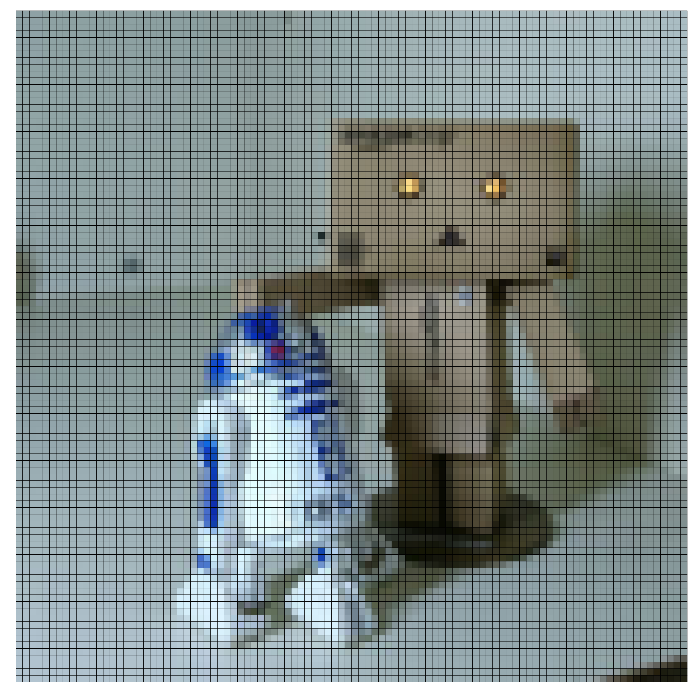

```{r setup, include=FALSE}
knitr::opts_chunk$set(
  echo = TRUE, 
  message = FALSE, error = FALSE, warning = FALSE # メッセージを非表示
)
```

----

【編集履歴】

- 2023.07.11：「ドット調の画像の作図」を追加

----


# ggplot2でドット調の画像を作りたい

　ggplot2パッケージを利用して、画像をドット調に変換します。ドット絵ではありません(適切な呼び方が分かりません)。\
\

　利用するパッケージを読み込みます。

```{r, eval=FALSE}
# 利用パッケージ
library(tidyverse)
library(raster)
library(magick)
```

　この記事では、`パッケージ名::関数名()`の記法を使うので、パッケージを読み込む必要はありません。\
　また、ネイティブパイプ演算子`|>`を使っています。`magrittr`パッケージのパイプ演算子`%>%`に置き換えても処理できますが、その場合は`magrittr`を読み込む必要があります。\
\


## ドット調の画像の作成

　ドット加工した画像を作成します。\
\

　画像データを読み込みます。

```{r}
# 画像ファイルパスを指定
file_path <- "../data/picture/icon.jpg"

# ラスタデータを読込
raster_dat <- raster::stack(x = file_path) # RGBデータを取得

# 画像サイズを取得
width_size  <- raster::ncol(raster_dat)
height_size <- raster::nrow(raster_dat)
width_size; height_size
```

　加工を行う画像のファイルパスを指定して、`stack()`でラスターデータとして読み込みます。\
　読み込んだ画像データの縦・横方向のピクセル数(ドット数)は`nrow()`・`ncol()`で得られます。\

　画像サイズなどが大きい場合は、解像度を調整します。

```{r}
# ラスタデータを読込
scale_val <- 4
raster_dat <- raster::stack(x = file_path) |> # RGBデータを取得
  raster::aggregate(fact = scale_val) # 解像度を下げる

# 画像サイズを取得
width_size  <- raster::ncol(raster_dat)
height_size <- raster::nrow(raster_dat)
width_size; height_size
```

　`aggregate()`の`fact`引数で解像度(縦横のピクセル数)を調整できます。指定した値`scale_val`の逆数`1/scale_val`個にピクセルが間引かれます。\

　RGBデータに応じたカラーコードを作成します。

```{r}
# 色データを作成
raster_df <- raster_dat |> 
  raster::as.data.frame(xy = TRUE) |> 
  tibble::as_tibble() |> 
  dplyr::rename(R = 3, G = 4, B = 5) |> 
  dplyr::mutate(RGB = rgb(red = R/255, green = G/255, blue = B/255)) # 正規化してカラーコードを取得
raster_df
```

　ラスタデータを`as.data.frame()`でRGBデータを格納したデータフレームに変換します。`xy`引数に`TRUE`を指定すると、座標(x軸・y軸の値)も格納されます。\
　RGBデータは、赤・緑・青の三色について0から255の256段階の整数を持ちます。それぞれ最大値の255で割ると、0から1の値に正規化されます。\
　`rgb()`でRGBデータに対応するカラーコードが得られます。\

　ドット加工した画像データを作成します。

```{r}
# ドット絵を作図
size_val <- 0.9
dot_graph <- ggplot2::ggplot() + 
  ggplot2::geom_point(data = raster_df,
                      mapping = ggplot2::aes(x = x, y = y, color = RGB),
                      size = size_val) + # ドット
  ggplot2::scale_color_identity() + # カラーコードによる色付け:(ドット用)
  # ggplot2::geom_tile(data = raster_df, 
  #                    mapping = ggplot2::aes(x = x, y = y, fill = RGB), 
  #                    color = "black") + # ピクセル
  # ggplot2::scale_fill_identity() + # カラーコードによる色付け:(ピクセル用)
  ggplot2::coord_equal(ratio = 1, expand = FALSE) + # 描画領域
  ggplot2::theme(
    axis.title       = ggplot2::element_blank(), # 軸ラベル
    axis.text        = ggplot2::element_blank(), # 軸目盛ラベル
    axis.ticks       = ggplot2::element_blank(), # 軸目盛指示線
    panel.grid       = ggplot2::element_blank(), # グリッド線
    panel.background = ggplot2::element_blank(), # 描画領域の背景
    plot.background  = ggplot2::element_rect(fill = "white", color = NA), # 全体の背景
    legend.position  = "none" # 凡例の位置
  )
```

　`geom_point()`でドットを描画します。`color`引数にカラーコード列を指定して`scale_color_identity()`を使うと、カテゴリデータではなくカラーコードとして認識されます。\
　または、`geom_tile()`でピクセルを描画します。こちらの場合は、`fill`引数と`scale_fill_identity()`を使います。\
　`coord_equal(ratio = 1)`でアスペクト比を1にします。`expand = FALSE`を指定すると、データの最小値・最大値に対して描画領域内に余白ができません。\
　目的に応じて、`theme()`で図の体裁を整えます。\

　画像データを書き出します。

```{r}
# 画像データを書出
scale_val <- 20
ggplot2::ggsave(
  plot = dot_graph, filename = "../output/dot_art/icon.png", 
  width = width_size/scale_val, height = height_size/scale_val, units = "i", dpi = 600
)
```




　作成した画像データを`ggsave()`で画像ファイルとして保存します。\
　出来栄えは、ドット数(`aggregate()`の`fact`引数で調整した`width_size, height_size`)、ドットサイズ(`geom_point()`の`size`引数)、画像サイズ(`ggsave()`の`width, height`引数)の関係で決まります。\
\


## ドット調のアニメーションの作成

　ドット加工した画像によるアニメーションを作成します。詳しくは「DotArt。R」を参照してください。\
\

　「ドット調の画像の作成」の処理を繰り返し行って、アニメーション(gif画像)を作成します。


　`magick`パッケージを使って、複数の画像ファイルをまとめてgifファイルに変換します。\
\

　この記事では、画像のドット加工を行いました。\
\


# 参考文献

- [https://github.com/ocean-v/various_code](https://github.com/ocean-v/various_code)


